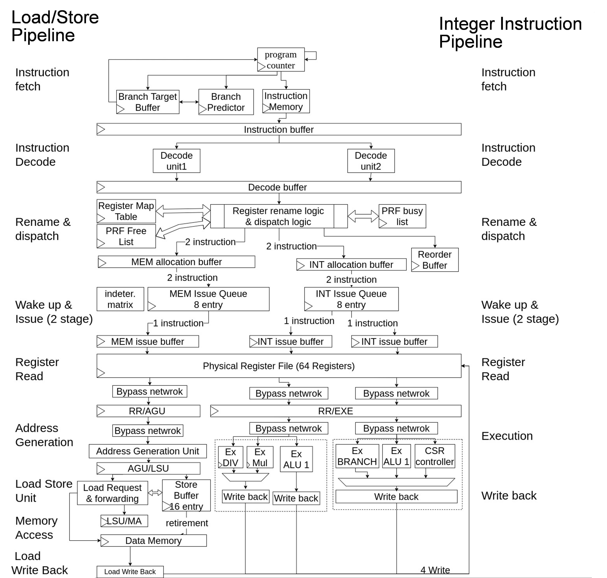

# The Falco superscalar core

Falco is an out-of-order superscalar developped at the Embedded Intelligent Systems Lab at NYCU (a.k.a. NCTU). The current release is just a 0.1 preview version. The superscalar can be synthesized for the Xilinx FPGA platform KC705 at 75Mhz. The RTL model of Falco is written in System Verilog. Currently, we provide two different ROMs in the processor cores to demonstrate the execution of Dhrystone and CoreMark, respectively. The outputs will be sent to the UART device (@115200 bps).

Falco is a 32-bit RISC-V core supporting RV32-IM instruction set. It has a 8-stage integer and 10-stage load/store pipeline. It does speculative execution with three-issue structure (two integer instructions and one load/store instruction). The microarchitecture is as follows:

Currentyl the performance of Falco is around 1.84 DMIPS/Mhz and 2.67 CoreMark/Mhz.
